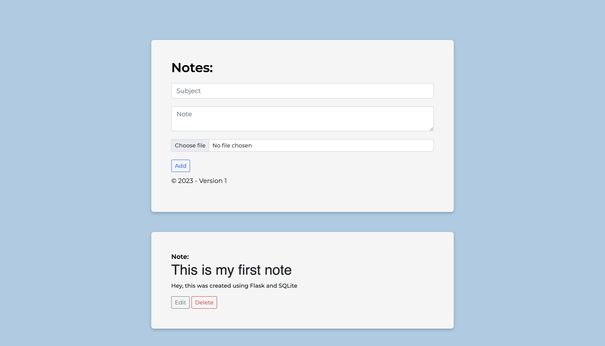

## Notes App w/ Flask

### Basic Web Application created with Flask using a SQLite Database

<br>

## Preview



## Note

__This mini project is still being tested and developed with AWS Services such as S3 and DynamoDB. Other versions will be updated soon.__

<br>

## Getting Started

This project was used in version Python 3.9+

### Setup
```
$ python3 -m venv venv 
$ source .venv/bin/activate
```

### Install Dependencies
```
$ pip install -r requirements.txt
```

### Startup
```
$ python3 application.py
```
